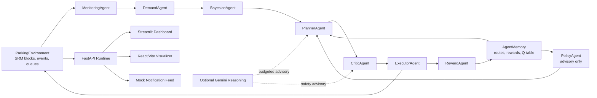

# SRM Smart Parking Agentic AI Architecture

## Control Invariants

- Planner proposes actions, but cannot execute directly.
- Critic validates safety, utility, risk, and capacity constraints.
- Executor validates executable vehicle count before environment application.
- PolicyAgent is advisory only and cannot override the critic-approved planner path.
- AgentMemory records successful routes, failed routes, reward trends, and Q-table updates.
- Gemini is optional and budgeted. Local reasoning keeps the system functional when keys, quota, or network are unavailable.

## Presentation View

The strongest demo path is:

1. Dashboard `SRM Operations` for live decision impact.
2. `Agent Loop` for planner/critic/executor trace.
3. `Reasoning` for explainability and LLM usage.
4. `Benchmark` for evidence against no-agent baseline.
5. `Prepare Run Report` for exportable proof.

## Real-World Extension Path

- Replace simulated entry/exit signals with gate counters, camera counts, or ANPR events.
- Replace mock notifications with mobile push, SMS, or signage APIs.
- Persist state in a database when multiple operators need shared history.
- Add admin approval policies for high-impact redirects.
- Add role-based access control before production deployment.

